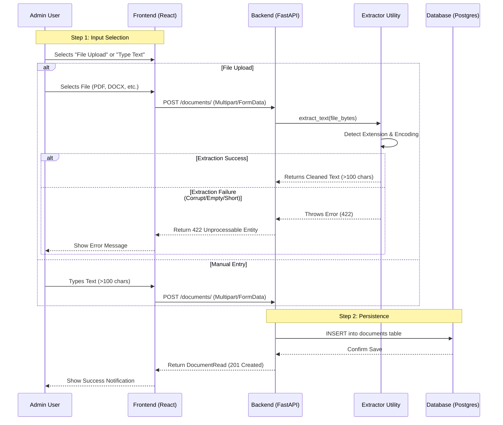

# Admin Workflow: Document Creation & Extraction

This document outlines the end-to-end workflow for system administrators to add documents to the Legal Assistant knowledge base.

## Workflow Overview

The system supports two primary ingestion paths:
1.  **Manual Entry**: Admin types text directly into a textarea.
2.  **File Upload**: Admin uploads a document (PDF, DOCX, etc.), and the system automatically "scrapes" the content.

### Interaction Flow Chart



---

## Detailed Workflow Steps

### 1. Preparation (Frontend)
The Admin Dashboard presents a "Create Document" form.
- **Fields required**: Title, Category, Content Source.
- **Dynamic Logic**: When "File" is selected, the "Text" field is hidden/disabled to ensure data integrity.

### 2. Submission (Frontend to Backend)
- **Data Packaging**: The data is sent using the standard `multipart/form-data` encoding.
- **Payload**:
  - `title`, `category_id`, `tags`
  - `content` (if manual) OR `file` (if upload).

### 3. Processing (Backend)
The backend intercepts the request and follows this logic:
- **Priority**: If a `file` is present, it takes precedence over the `content` string.
- **Extraction**: The `file_extractor.py` module dispatches the file to high-level parsers:
  - `.pdf` -> `pdfminer`
  - `.docx` -> `python-docx`
  - `.xlsx` -> `openpyxl`
  - `.pptx` -> `python-pptx`
- **Normalization**: All whitespace (tabs, newlines, multiple spaces) is collapsed into single spaces to optimize for search and display.

### 4. Validation & Errors
The workflow fails (stops) if:
- **Missing Input**: Neither file nor manual text is provided.
- **Invalid Type**: File format is not supported (e.g., `.dmg`, `.exe`).
- **Corrupt File**: Library fails to open the file (throws `FileExtractionError`).
- **Content Too Short**: The result of the extraction is less than **100 characters**.

### 5. Finalization
On success, a new record is created in the `documents` table. The user is redirected to the document details page or shown a "Success" toast notification.

---

## Administration Setup

To ensure this workflow functions correctly, the following environment setup is required on the server:

```bash
# Install parsing dependencies
pip install pdfminer.six python-docx openpyxl python-pptx chardet python-multipart
```

**Global Thresholds**:
The minimum character requirement is controlled in `app/utils/file_extractor.py`:
```python
MIN_CONTENT_LENGTH = 100
```
