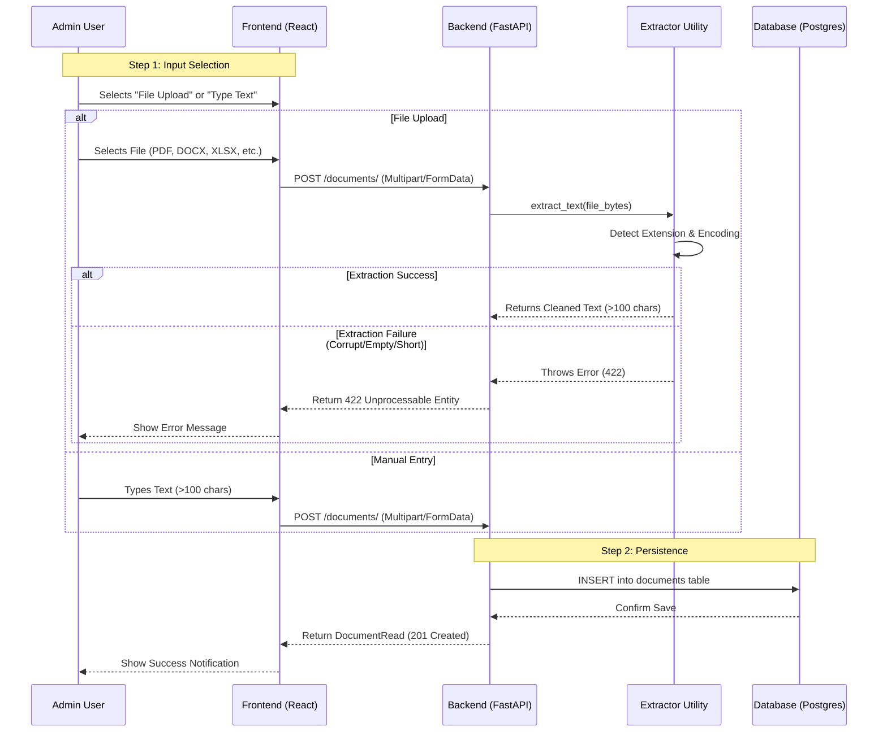

# Legal Assistant API Documentation & Workflow

This document provides a comprehensive overview of the Legal Assistant backend API, including the interaction workflows and schema definitions.

## 1. System Workflow: Document Creation & Extraction

The following diagram illustrates the interaction between the frontend, backend, and extraction utility when an administrator adds a document.



---

## 2. Document API (`/documents`)

Manages the core knowledge entities of the system.

### POST `/documents/`
**Operation**: Create a new document via manual text or file upload.  
**Content-Type**: `multipart/form-data`

| Field | Type | Required | Description |
|---|---|---|---|
| `category_id` | `UUID` | ✅ | Parent category ID |
| `title` | `string` | ✅ | Document title |
| `content` | `string` | ❌ | Manual text entry (ignored if `file` is provided) |
| `file` | `binary` | ❌ | Uploaded file (PDF, DOCX, XLSX, PPTX, TXT) |
| `tags` | `string` | ❌ | JSON string of tags, e.g. `'["legal"]'` |
| `status` | `string` | ❌ | Default: `"published"` |
| `created_by` | `UUID` | ❌ | Author user ID |

**Responses**:
- `201 Created`: Returns `DocumentRead`
- `422 Unprocessable`: "Extracted content too short" or "Unsupported file type"

### Other Document Routes
- `GET /documents/`: List documents (supports `category_id` filter)
- `GET /documents/{id}`: Get document by ID
- `PUT /documents/{id}`: Partial update (JSON body)
- `DELETE /documents/{id}`: Soft delete

---

## 3. Category API (`/categories`)

Manages document organization.

### POST `/categories/`
**Body**: `CategoryCreate` (JSON)
- `title`: (string) Unique
- `description`: (string, optional)
- `is_active`: (boolean, default: true)

**Routes**:
- `GET /categories/`: List all active categories
- `GET /categories/{id}`: Get details
- `PUT /categories/{id}`: Update info
- `DELETE /categories/{id}`: Soft delete (also soft-deletes associated documents)

---

## 4. Data Schemas (JSON)

### DocumentRead
```json
{
  "id": "uuid",
  "category_id": "uuid",
  "title": "string",
  "content": "string",
  "tags": ["string"],
  "metadata": {},
  "status": "string",
  "created_at": "datetime",
  "updated_at": "datetime"
}
```

### CategoryRead
```json
{
  "id": "uuid",
  "title": "string",
  "description": "string",
  "is_active": true,
  "created_at": "datetime"
}
```

---

## 5. Technical Setup
To enable file extraction on the server, ensure the following dependencies are installed:
```bash
pip install pdfminer.six python-docx openpyxl python-pptx chardet python-multipart
```
